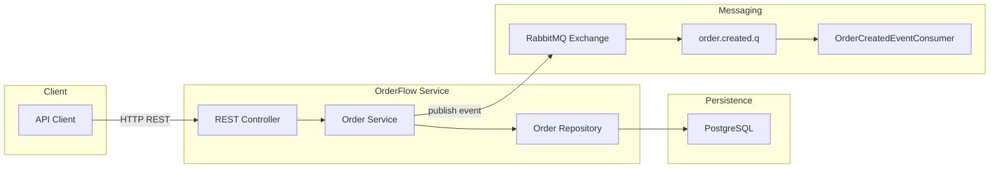
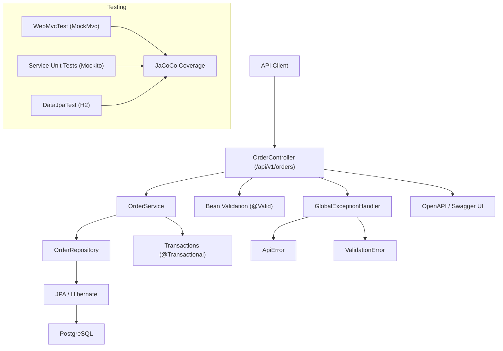
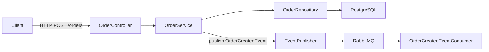
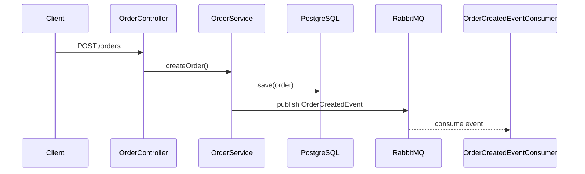
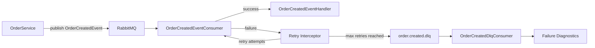

# OrderFlow

[](https://codecov.io/gh/ME-Massine/Orderflow)


`OrderFlow` is a production-oriented backend system built to demonstrate clean architecture, disciplined engineering practices, and portfolio-grade backend maturity using `Spring Boot` and `PostgreSQL`.

---

## System Overview

`OrderFlow` is a production-oriented backend service designed to demonstrate real-world backend engineering practices:

- Strict layered architecture
- Versioned `REST API` contracts
- Structured error handling
- Multi-layer testing strategy
- `CI`-driven quality enforcement
- Containerized runtime environment
- Event-driven architecture
- Messaging reliability patterns

## System Architecture

The following diagram shows the high-level system architecture of `OrderFlow` and how external clients interact with the service, database, and messaging infrastructure.



### Architecture Explanation

`OrderFlow` follows a layered service architecture combined with event-driven messaging.

`API Clients` interact with the service through a versioned `REST API`.

The `Controller` layer handles `HTTP` transport and validation.

The `Service` layer implements business logic and transactional boundaries.

The `Repository` layer abstracts persistence using `Spring Data JPA`.

Data is stored in `PostgreSQL`.

After a successful order creation, the service emits an `OrderCreatedEvent`.

The event is published to `RabbitMQ`, enabling asynchronous processing by consumers.

---

## Repository Structure

```
services/
  order-service/
    controller/
    service/
    repository/
    entity/
    dto/
    exception/
    messaging/
      config/
      event/
      publisher/
      consumer/
```

---

## Layered Architecture







When an order is created, the service emits a domain event (`OrderCreatedEvent`) to `RabbitMQ`.

This allows other services to react asynchronously without tightly coupling them to the `Order` service.

Possible future consumers:

- Inventory service reserving stock
- Payment service initiating transactions
- Notification service sending confirmations

---

## Message Delivery Lifecycle



This lifecycle demonstrates how `OrderFlow` processes events safely:

1. Order service publishes an event.
2. Consumer processes the message.
3. If processing fails, `Spring AMQP` retries automatically.
4. If retries fail, the message is routed to a `Dead Letter Queue` (`DLQ`).
5. The `DLQ` consumer records diagnostic information for debugging.

---

## Event Contract: OrderCreatedEvent

```json
{
  "eventId": "uuid",
  "occurredAt": "2026-03-04T12:00:00Z",
  "orderId": 1,
  "customerId": "cust-1",
  "productId": 101,
  "quantity": 2,
  "status": "PENDING"
}
```

Fields:

- `eventId` — unique identifier for the event
- `occurredAt` — timestamp of event creation
- `orderId` — identifier of the order
- `customerId` — customer placing the order
- `productId` — ordered product
- `quantity` — amount ordered
- `status` — order status at creation

---

## Messaging Infrastructure

`RabbitMQ` is used as the messaging broker.

Messaging components include:

- `RabbitMqConfig` — exchange, queue, and binding configuration
- `EventPublisher` — abstraction for publishing events
- `RabbitMqEventPublisher` — `RabbitMQ` implementation
- `OrderCreatedEventConsumer` — event consumer
- `OrderCreatedDlqConsumer` — dead letter queue consumer

The messaging layer is isolated behind a publisher abstraction, allowing infrastructure changes without modifying domain logic.

---

## Messaging Reliability

`OrderFlow` implements several reliability mechanisms used in production event-driven systems.

### Retry Strategy

Message processing failures trigger automatic retries using `Spring AMQP` retry interceptors.

Configuration:

- maximum attempts: 3
- exponential backoff
- failed messages routed to `DLQ`

---

### Dead Letter Queue (DLQ)

If message processing fails after retries, the message is republished to:

```
order.created.dlq
```

A dedicated consumer processes `DLQ` messages and logs:

- original exchange
- routing key
- exception message
- stack trace
- event payload

This improves operational debugging and failure visibility.

---

### Idempotent Consumer

`RabbitMQ` provides at-least-once delivery, which means duplicate messages are possible.

`OrderFlow` protects against duplicate processing using an idempotency guard.

Components:

- `IdempotencyStore`
- `InMemoryIdempotencyStore`

Consumers record processed event IDs and safely skip duplicates.

---

### Messaging Metrics

Messaging activity is instrumented using `Micrometer` counters:

- `orderflow.messaging.events.consumed`
- `orderflow.messaging.events.duplicates`
- `orderflow.messaging.events.failed`
- `orderflow.messaging.events.dlq`

Metrics are exposed via `Spring Boot Actuator`.

---

## Quickstart (Recommended)

The fastest way to run `OrderFlow` is with `Docker`.

### Requirements

- `Docker Desktop`

### Run

From repository root:

```bash
docker compose up --build
```

### Access

- Service: [http://localhost:8081](http://localhost:8081)
- Swagger UI: [http://localhost:8081/swagger-ui/index.html](http://localhost:8081/swagger-ui/index.html)
- Health endpoint: [http://localhost:8081/actuator/health](http://localhost:8081/actuator/health)

---

## Tech Stack

- `Java 17`
- `Spring Boot 3`
- `Spring Web`
- `Spring Data JPA`
- `PostgreSQL`
- `H2` (test profile)
- `RabbitMQ`
- `Spring Boot Actuator`
- `OpenAPI` / `Swagger`
- `Docker` / `Docker Compose`
- `GitHub Actions CI`
- `JaCoCo` + `Codecov`

---

## API Versioning

All endpoints are versioned:

`/api/v1/orders`

---

## API Endpoints

### Create Order

`POST /api/v1/orders`

```json
{
  "customerId": "c1",
  "productId": 101,
  "quantity": 2
}
```

---

### Get Order

`GET /api/v1/orders/{id}`

---

### List Orders

`GET /api/v1/orders?page=0&size=10`

---

### Update Status

`PATCH /api/v1/orders/{id}/status?status=CONFIRMED`

Statuses:

- `PENDING`
- `CONFIRMED`
- `CANCELLED`

---

## Testing Strategy

`OrderFlow` includes three test layers.

### Web Layer Tests

- `@WebMvcTest`
- `MockMvc`
- validation and contract verification

### Repository Tests

- `@DataJpaTest`
- `H2` in-memory database
- `JPA` mapping verification

### Service Unit Tests

- `Mockito`
- business logic validation
- event publication verification

Run all tests:

```bash
./mvnw test
```

---

## Observability

`OrderFlow` exposes runtime diagnostics using `Spring Boot Actuator`.

Available endpoints:

- `/actuator/health`
- `/actuator/metrics`
- `/actuator/info`

Messaging metrics integrate with `Micrometer` and are compatible with monitoring systems.

---

## Versioning

Release discipline:

- semantic versioning
- version bump before tagging
- tags aligned with `pom` version
- automated `GitHub` version badge

---

## Engineering Practices

- Conventional commits
- `DTO` isolation
- transactional service boundaries
- profile-based configuration
- `CI`-driven validation
- Dockerized runtime

---

## Roadmap

### Completed milestones:

- Layered architecture
- Versioned `REST API`
- `OpenAPI` documentation
- Dockerized runtime
- `CI` pipeline
- `RabbitMQ` event publishing
- Event consumer implementation
- Retry strategy
- Dead-letter queue processing
- Idempotent event consumption
- Messaging metrics

### Upcoming milestones:

- Transactional Outbox pattern
- Durable idempotency storage
- Message replay tooling
- Distributed tracing
- Multi-service architecture

---

## Why This Project Matters

`OrderFlow` demonstrates:

- architectural discipline
- production-grade `API` design
- event-driven messaging
- reliability mechanisms
- operational observability

It is designed to reflect how real backend systems evolve incrementally through versioned, test-driven milestones.
