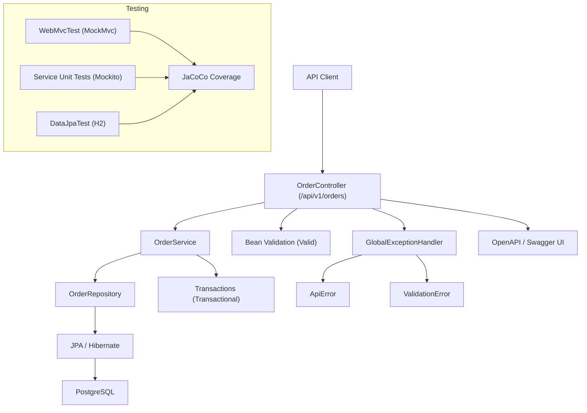

# OrderFlow

[](https://codecov.io/gh/ME-Massine/Orderflow)


OrderFlow is a production-oriented backend system built to demonstrate clean architecture, disciplined engineering practices, and portfolio-grade backend maturity using Spring Boot and PostgreSQL.

---

## System Overview

OrderFlow is a production-oriented backend service designed to demonstrate real-world backend engineering practices:

• Strict layered architecture  
• Versioned REST API contracts  
• Structured error handling  
• Multi-layer testing strategy  
• CI-driven quality enforcement  
• Containerized runtime environment

---

## Architecture



---

## Quickstart (Recommended)

The fastest way to run OrderFlow is via Docker.

### Requirements

- Docker Desktop

### Run

From repository root:

```bash
docker compose up --build
```

### Access

- Service: [http://localhost:8081](http://localhost:8081)
- Health: [http://localhost:8081/actuator/health](http://localhost:8081/actuator/health)
- Swagger UI: [http://localhost:8081/swagger-ui/index.html](http://localhost:8081/swagger-ui/index.html)

Docker provisions PostgreSQL automatically and configures the service via environment variables.

---

### Responsibilities

- Controller: Handles HTTP transport only.
- Service: Contains business logic and transaction boundaries.
- Repository: Encapsulates data access.
- Entity: Persistence model only.
- DTO: API contract model.

This separation ensures maintainability, scalability, and testability.

---

## Tech Stack

- Java 17
- Spring Boot 3
- Spring Web
- Spring Data JPA
- PostgreSQL
- H2 (test profile)
- Spring Boot Actuator
- OpenAPI / Swagger
- Docker / Docker Compose
- GitHub Actions CI

---

## API Versioning

All endpoints are versioned:

`/api/v1/orders`

---

## API Endpoints

### Create Order

`POST /api/v1/orders`

Request:

```json
{ "customerId": "c1", "productId": 101, "quantity": 2 }
```

---

### Get Order

`GET /api/v1/orders/{id}`

---

### List Orders

`GET /api/v1/orders?page=0&size=10`

---

### Update Status

`PATCH /api/v1/orders/{id}/status?status=CONFIRMED`

Statuses:

- PENDING
- CONFIRMED
- CANCELLED

---

## Testing Strategy

OrderFlow includes three distinct test layers:

### Web Layer Contract Tests

- `@WebMvcTest`
- `MockMvc`
- Validation and error handling verification

### Repository Slice Tests

- `@DataJpaTest`
- H2 in-memory database
- JPA mapping verification
- `@PrePersist` validation

### Service Unit Tests

- Pure Mockito
- Business logic validation
- Pageable construction verification
- NotFound scenarios
- Transactional mutation behavior

All tests pass via:

```bash
./mvnw test
```

---

## Observability

- Spring Boot Actuator
- Health endpoint
- Metrics endpoint (Prometheus ready)
- Structured JSON error responses

---

## Versioning

Release discipline:

- Semantic versioning
- Version bump before tagging
- Tags aligned with pom version

Latest release: v0.4.0

---

## Engineering Practices

- Conventional Commits
- DTO isolation from entities
- Transactional service boundaries
- Profile-based configuration (dev/test/docker)
- CI-based validation
- Dockerized reproducible runtime

---

## Roadmap

Upcoming milestone:

- JaCoCo coverage enforcement (v0.5.0)
- Coverage threshold in CI
- Coverage badge in README

Future direction:

- RabbitMQ integration (OrderCreated event)
- Domain events pattern
- Multi-service orchestration
- Reliability patterns (idempotency, outbox)

---

## Why This Project Matters

OrderFlow demonstrates:

- Architectural discipline
- Correct HTTP semantics
- Clean test isolation
- Reproducible runtime
- Production-ready structure

It is built to reflect how real backend systems evolve ---
incrementally, versioned, and test-driven.
